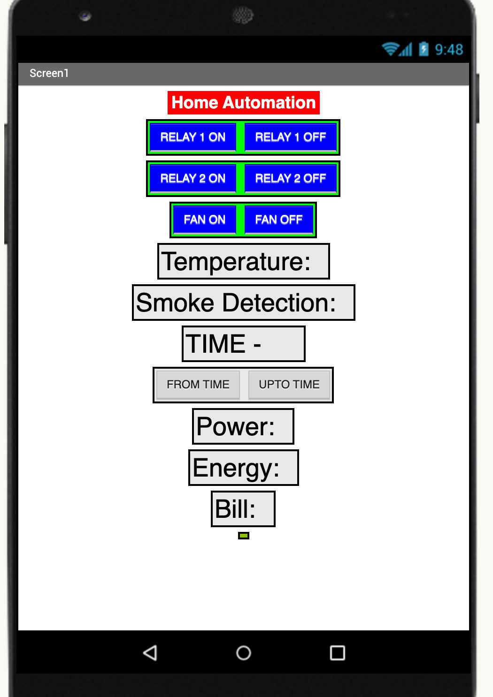

# Home Automation System using Arduino, NodeMCU, and Firebase

## Overview

This project is a comprehensive home automation system that integrates Arduino and NodeMCU for sensor control and data transmission. The system allows for remote monitoring and control of home appliances via a mobile app developed using MIT App Inventor.

## Features

- **Sensor Integration**: Monitors temperature, smoke, and motion using respective sensors.
- **Appliance Control**: Controls LED bulbs and a fan through relay modules.
- **Time-Based Control**: Manages the operational time for appliances, allowing users to set specific on/off times for the bulb and fan.
- **Data Transmission**: Real-time data transmission to Firebase.
- **Alert Mechanism**: Buzzer alerts for smoke detection.
- **Power Consumption Monitoring**: Calculates energy consumption and estimated electricity bills.
- **Mobile App Interface**: Allows users to control devices, monitor sensor data, and receive alerts.

## Hardware Components

- **Arduino**
- **NodeMCU**
- **Temperature Sensor**
- **Smoke Sensor**
- **PIR Sensor**
- **Relay Module**
- **LED Bulbs**
- **Fan**
- **Buzzer**
- **RTC DS1302 Real Time Clock Sensor Module**

## Software

- **Arduino IDE**: For programming the Arduino and NodeMCU.
- **Firebase**: For real-time data storage and retrieval.
- **MIT App Inventor**: For creating the mobile application.

## Installation

1. **Setup Hardware**:
   - Connect the sensors and actuators to the Arduino and NodeMCU as per the provided circuit diagram.
   - Ensure proper wiring for the relay module and power sources.

2. **Upload Code**:
   - Upload the NodeMCU code to the NodeMCU board.
   - Upload the Arduino code to the Arduino board.

3. **Configure Firebase**:
   - Set up a Firebase project and configure the database.
   - Update Firebase credentials in the NodeMCU code.

4. **Develop Mobile App**:
   - Use MIT App Inventor to create and deploy the mobile app for user interaction.

## Mobile App Interface

Here is a screenshot of the mobile app interface:

## Usage

1. **Control Devices**:
   - Use the mobile app to turn LED bulbs and the fan on/off.
   - Monitor temperature, smoke levels, and motion detection.

2. **Manage Operational Time**:
   - Set specific times for the bulb and fan to be turned on and off using the mobile app.

3. **Receive Alerts**:
   - Get notifications on smoke detection and other critical events.

4. **Monitor Power Consumption**:
   - View real-time energy consumption and estimated electricity bills through the app.

## Code

- **NodeMCU Code**: Handles data collection from sensors and communication with Firebase.
- **Arduino Code**: Manages sensor readings and controls actuators.
